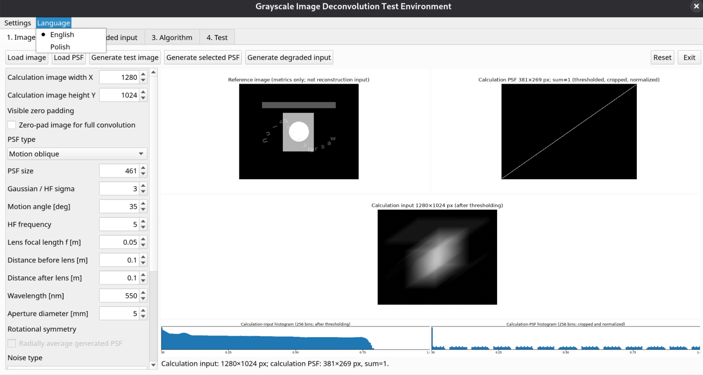
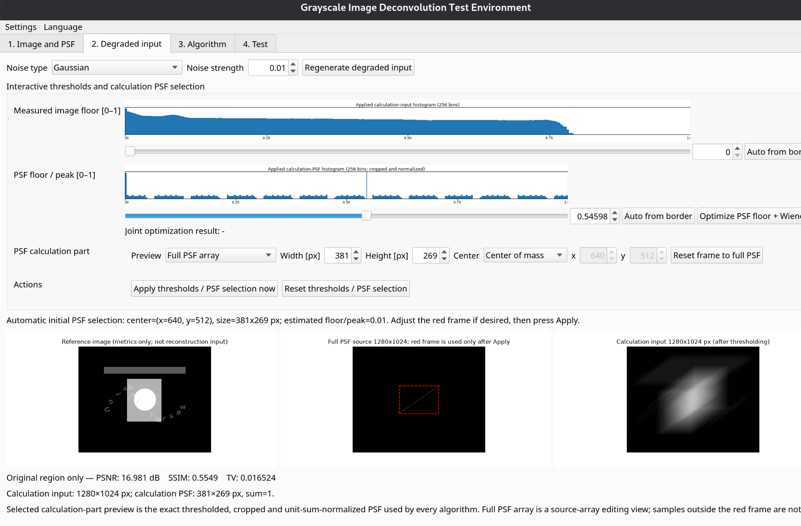
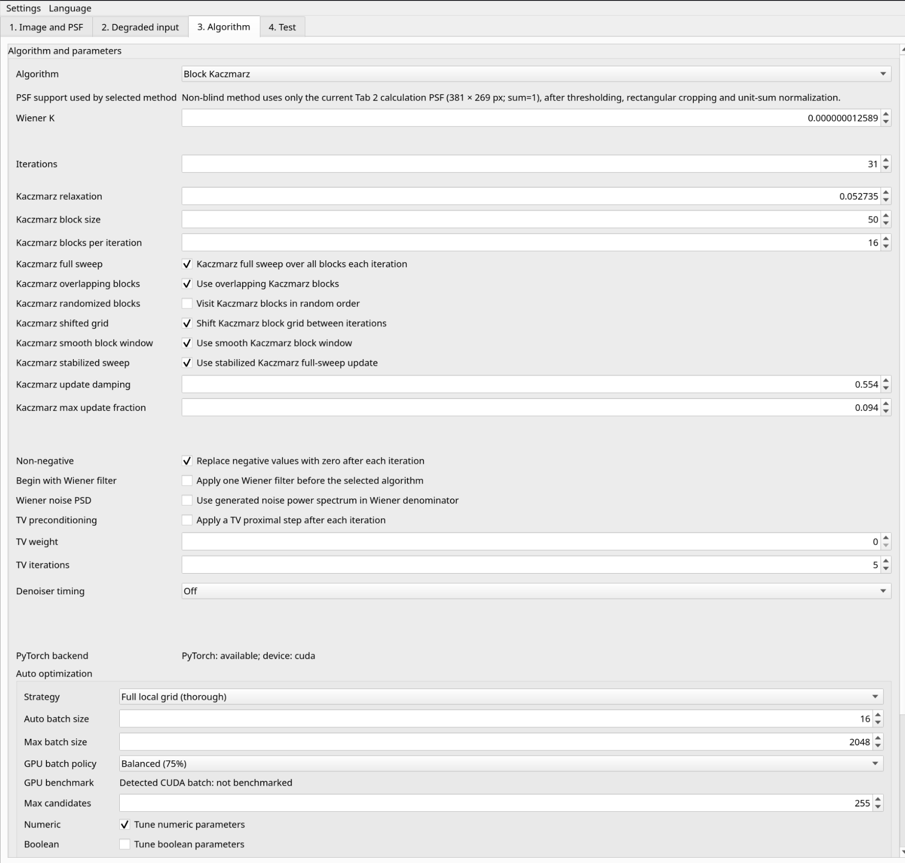
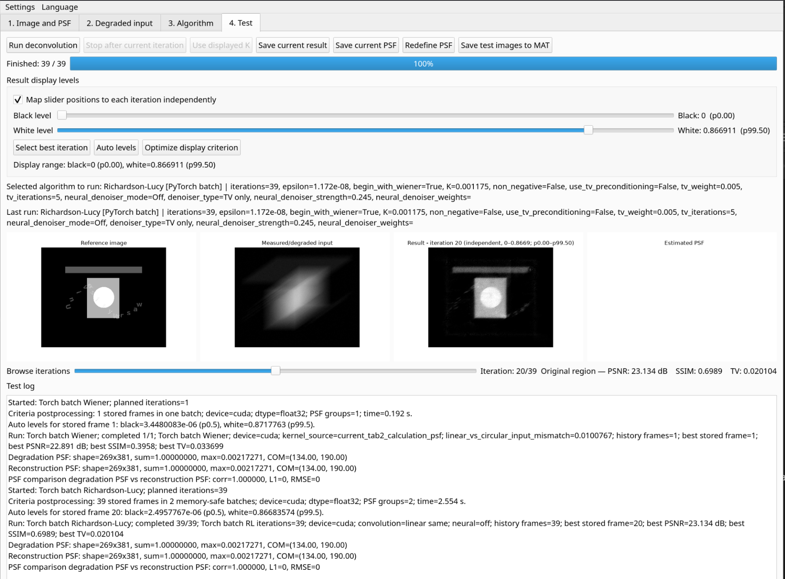

# Dekonwolucje / Deconvolution GUI

[English](#english) · [Polski](#polski)


## Screenshots / Zrzuty ekranu

### Main workflow and bilingual interface / Główny przepływ pracy i interfejs dwujęzyczny

<p align="center">
  
</p>

*English:* Main application window with the calculation image and PSF, their histograms and resolution information, and the runtime English/Polish language selector.  
*Polski:* Główne okno programu z obrazem i PSF używanymi w obliczeniach, ich histogramami i informacją o rozdzielczości oraz przełącznikiem języka angielskiego/polskiego.

### Thresholding and PSF selection / Progowanie i wybór obszaru PSF

<p align="center">
  
</p>

*English:* Tab 2 with applied histograms, image and PSF thresholds, and the editable red rectangular support used to create the cropped, unit-sum calculation PSF.  
*Polski:* Karta 2 z histogramami po zastosowaniu ustawień, progami obrazu i PSF oraz edytowalną czerwoną ramką wyznaczającą przyciętą PSF obliczeniową normalizowaną do sumy jeden.

### Block Kaczmarz parameters / Parametry blokowej metody Kaczmarza

<p align="center">
  
</p>

*English:* Algorithm tab with Block Kaczmarz selected, including block geometry, sweep stabilization, damping, update clipping and Auto controls.  
*Polski:* Karta algorytmu z wybraną blokową metodą Kaczmarza, obejmująca geometrię bloków, stabilizację przebiegu, tłumienie, ograniczenie aktualizacji i ustawienia Auto.

### Iteration history and result assessment / Historia iteracji i ocena wyniku

<p align="center">
  
</p>

*English:* Tab 4 after a multi-iteration reconstruction, with the selected result, black/white display levels, batch-computed criteria and the processing log.  
*Polski:* Karta 4 po rekonstrukcji wieloiteracyjnej, z wybranym wynikiem, poziomami czerni i bieli, kryteriami obliczonymi wsadowo oraz dziennikiem przetwarzania.

## English

A desktop research application for grayscale-image deconvolution with a known or unknown point-spread function (PSF). The GUI provides Wiener, Richardson–Lucy, Rosen, Landweber, Kaczmarz, Adam TV-MAP and blind-deconvolution variants, with optional PyTorch/CUDA acceleration.

The interface can be switched at runtime between **English** and **Polish** using **Language / Język** in the menu. The selected language is stored in the active JSON settings profile. Source-code comments, configuration keys and algorithm identifiers remain in English.

### Installation

```bash
python -m venv .venv
source .venv/bin/activate
python -m pip install --upgrade pip
python -m pip install -e .
dekonwolucje
```

Optional PyTorch support:

```bash
python -m pip install -e ".[gpu]"
```

For a CUDA-enabled PyTorch build, install the wheel appropriate for the local CUDA/driver environment and then install this project.

Alternative launch commands:

```bash
python -m deconv
python run_deconvolution_gui.py
```

### Documentation

- [English PDF: program description and numerical methods](docs/Deconvolution_GUI_and_Methods_EN.pdf)
- [English user guide](docs/USER_GUIDE_EN.md)
- [English architecture and developer guide](docs/ARCHITECTURE_EN.md)
- [English Python API guide](docs/API_EN.md)
- [English changelog](docs/CHANGELOG_EN.md)
- [Screenshot source files and captions](docs/screenshots/README.md)
- [Polish user guide](docs/USER_GUIDE_PL.md)
- [Polish architecture and developer guide](docs/ARCHITECTURE_PL.md)
- [Polish changelog](docs/CHANGELOG_PL.md)

### Using the algorithms without the GUI

The numerical methods are available through a Qt-independent Python API:

```python
from deconv.api import generate_test_image, generate_motion_psf, disturb_image, wiener_filter

reference = generate_test_image(width=384, height=256)
psf = generate_motion_psf(size=31, angle_deg=35)
disturbed = disturb_image(reference, psf, noise_sigma=0.01, seed=7)
result = wiener_filter(disturbed, psf, K=2e-3)
restored = result.image.data
```

A complete runnable example is provided in `examples/wiener_motion_blur.py`. See [API_EN.md](docs/API_EN.md) for the complete interface and all registered algorithms.

### AI-assisted development disclosure

Parts of the software and documentation were prepared with assistance from tools based on large language models (LLMs). Their suggestions were incorporated as part of the development process; numerical methods, implementation details and results should nevertheless be independently verified for the intended scientific application.

### Testing

```bash
python -m pip install -e ".[test]"
pytest
```

### License and author

MIT License. Copyright © 2026 **Rafał Kotyński**, University of Warsaw, Faculty of Physics.

Homepage: <https://github.com/rkotynski/dekonwolucje>

---

## Polski

Aplikacja badawcza z interfejsem graficznym do dekonwolucji obrazów w skali szarości ze znaną lub nieznaną punktową funkcją rozmycia (PSF). Program zawiera warianty metod Wienera, Richardsona–Lucy'ego, Rosena, Landwebera, Kaczmarza, Adam TV-MAP i dekonwolucji ślepej, z opcjonalnym przyspieszeniem PyTorch/CUDA.

Język interfejsu można przełączać podczas działania programu między **polskim** i **angielskim** w menu **Język / Language**. Wybór jest zapisywany w aktywnym profilu ustawień JSON. Komentarze w kodzie, klucze konfiguracji i identyfikatory algorytmów pozostają angielskie.

### Instalacja

```bash
python -m venv .venv
source .venv/bin/activate
python -m pip install --upgrade pip
python -m pip install -e .
dekonwolucje
```

Opcjonalna obsługa PyTorch:

```bash
python -m pip install -e ".[gpu]"
```

Dla PyTorch z CUDA należy najpierw zainstalować pakiet odpowiedni dla lokalnego środowiska CUDA i sterownika, a następnie zainstalować projekt.

Alternatywne sposoby uruchomienia:

```bash
python -m deconv
python run_deconvolution_gui.py
```

### Dokumentacja

- [Angielski PDF: opis programu i metod numerycznych](docs/Deconvolution_GUI_and_Methods_EN.pdf)
- [Instrukcja użytkownika po polsku](docs/USER_GUIDE_PL.md)
- [Architektura i przewodnik programisty po polsku](docs/ARCHITECTURE_PL.md)
- [Opis API Pythona po polsku](docs/API_PL.md)
- [Historia zmian po polsku](docs/CHANGELOG_PL.md)
- [Pliki źródłowe zrzutów i podpisy](docs/screenshots/README.md)
- [English user guide](docs/USER_GUIDE_EN.md)
- [English architecture and developer guide](docs/ARCHITECTURE_EN.md)
- [English Python API guide](docs/API_EN.md)
- [English changelog](docs/CHANGELOG_EN.md)
- [Screenshot source files and captions](docs/screenshots/README.md)

### Używanie algorytmów bez GUI

Metody numeryczne są dostępne przez API Pythona niezależne od Qt:

```python
from deconv.api import generate_test_image, generate_motion_psf, disturb_image, wiener_filter

reference = generate_test_image(width=384, height=256)
psf = generate_motion_psf(size=31, angle_deg=35)
disturbed = disturb_image(reference, psf, noise_sigma=0.01, seed=7)
result = wiener_filter(disturbed, psf, K=2e-3)
restored = result.image.data
```

Kompletny przykład znajduje się w `examples/wiener_motion_blur.py`. Pełny opis interfejsu i wszystkich zarejestrowanych algorytmów zawiera [API_PL.md](docs/API_PL.md).

### Informacja o użyciu narzędzi AI

Przy przygotowaniu części programu i dokumentacji korzystano z narzędzi opartych na dużych modelach językowych (LLM). Ich sugestie włączano w ramach procesu tworzenia projektu; metody numeryczne, szczegóły implementacji i wyniki należy jednak niezależnie zweryfikować dla zamierzonego zastosowania naukowego.

### Testy

```bash
python -m pip install -e ".[test]"
pytest
```

### Licencja i autor

Licencja MIT. Copyright © 2026 **Rafał Kotyński**, Wydział Fizyki Uniwersytetu Warszawskiego.

Strona projektu: <https://github.com/rkotynski/dekonwolucje>

## Screenshots and method references / Zrzuty i literatura metod

The repository includes the four screenshots used in the English PDF under `docs/screenshots/`. The PDF also contains clickable citations to original or classical publications for the principal numerical methods. See `docs/REFERENCES.md`.

Repozytorium zawiera cztery zrzuty użyte w angielskim PDF w katalogu `docs/screenshots/`. PDF zawiera również klikalne odwołania do prac oryginalnych lub klasycznych dotyczących głównych metod numerycznych. Zobacz `docs/REFERENCES.md`.
